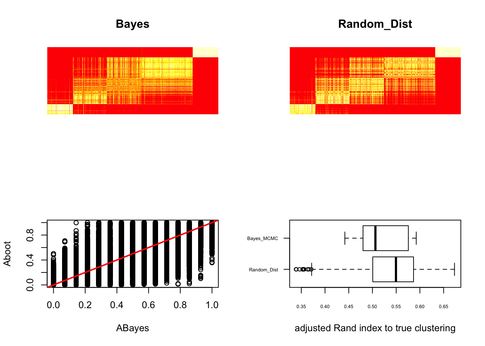

When using dirichlet process to model the prior of partitions. It is convenient to use an equivalent representation

$$P(\pi) \propto \prod_{i = 1} ^ K \theta \Gamma(q_i).........(1)$$. 

Assuming there are $K$ clusters and $q_i$ is number of elements in cluster $i$. 
Now we only interested in the case that $K$ is known(fixed). We want to approximate the posterior inference of clustering based on dirichlet process prior through a random distance matrix manner. 

###
An intuitive idea is that we sample partitions of data using the probability in (1).
We then generate a distance matrix $\hat{D} = \{\hat{d_{ij}}\}$ based on the sampled partition. $\hat{d_{ij}}$ is 1 if point $i$ and $j$ come from different cluster, 0 otherwise. Then we convert the prior of partitions to prior of distance matrices. And using those prior on distance matrices should have approximately same posterior inference as using dirichlet process. Unfortunately, this is computational intractable. For example (below)


```r
##function to calculate number of possible ways to partition n subjects to k groups
count_partitions = function(n,k){
  #! param n, number of elements
  #! param k, number of groups
  # return number of partitions of n elements into k groups
  dp = matrix(0, nrow = n + 1, ncol = k + 1)
  
  for (i in 2:(n + 1)){
    for (j in 2:(k + 1)){
      if (j == 2 || i == j){
        dp[i,j] = 1
      }
      else{
        dp[i,j] = (j - 1) * dp[i-1,j] + dp[i-1,j-1]
      }
    }
  }
  return(dp[n + 1 , k + 1])
}

count_partitions(100,5)
```

```
## [1] 6.573841e+67
```
We found that the possible number of ways to classify 100 subjects to 5 sets is 6.5e+67. Also there is not an explicit way to generate partitions, partitions are generated sequentially. Given that amount of possible paritions, both time complexity and storage problem make it infeasible. 

Another simple idea is that no matter what prior we put on partitions, the marginal probability that subject $i$ and $j$ under no information about their similarity belong to same cluster is $1/K$($K$: number of clusters)
$$\sum_{partition} P(\text{subject }i \text{ and subject }j \text{ belong to same cluster} | \text{partition})Prior(\text{partiton}) = 1 / K$$
For any proper prior on the possible paritions that classify $n$ subjects into $K$ groups. As given the parition label of subject $i$, the chances that subject $j$ has the same label is $1 / K$

Then we could sample distance matrix $\hat{D} = \{\hat{d_{ij}}\}$, that $\hat{d_{ij}}$
is bernoulli distributed with $p = 1 - 1/K$. 

Below we have functions to generate $p(c_i = c_j | x)$ based on random distance method. $c_i, c_j$ are the parition label of subject $i$ and $j$, $x$ is the data

```r
mimic_dp = function(n, K){
  #! param n, number of elements
  #! param K, number of clusters
  alp = K - 1
  if(alp < 1){
    print("error, K should be greater than 1")
    return(0)
  }
  p_ = rep(0,n)
  #number of elements added, start with 1 element
  num = 1
  #number of elements per group
  num_per_cl = rep(0,n)
  num_per_cl[1] = 1
  #initial prob for assigning class under dirichlet process
  p_[1] = num_per_cl[1] / (num + alp)
  p_[2] = alp / (num + alp)
  
  #class label
  cl_label = rep(0, n)
  cl_label[0] = 1
  pool = 1:n
  for(i in 2:n){
    idx_ = sample(pool,1,F,p_)
    num_per_cl[idx_] = num_per_cl[idx_] + 1
    num = num + 1
    p_ = num_per_cl / (num + alp)
    # position for staring new class
    pos = which(p_ == 0)[1]
    p_[pos] = alp / (num + alp)
    cl_label[i] = idx_
  }
  noise = 1 * outer(cl_label,cl_label,"==")
  
  return(noise)
  
}


boot = function(n, K, x, B){
  # p_ = 1 / K
  D_ = as.matrix(dist(x))
  rand_boot = rep(0,B)
  Aboot <- matrix(0,n,n)
  
  for(b_ in 1:B){
    # noise = matrix(rbinom(n^2, prob=1-p_,size=1),nrow=n)
    # ## to make noise be a symmetric matrix
    # up_ = 1 * upper.tri(noise, diag = FALSE)
    # noise = noise * up_
    # noise = noise + t(noise)
    noise = mimic_dp(n,K)
    weight = 0.3
    noise = noise * weight
    bar = noise + D_
    dst.star <- as.dist( bar )
    hc = hclust(dst.star,"complete")
    clus = cutree(hc, k = K)
    # clus = pam(bar,K,diss = T)$clustering
    rand_boot[b_] = adjustedRandIndex(clus, true.clust)
    tmp = outer(clus,clus, "==")
    Aboot <- Aboot + tmp/B
    
  }
  res = list()
  res[[1]] = Aboot
  res[[2]] = rand_boot
  return(res)
}
```


Also we have functions to generate $p(c_i = c_j | x)$ based on dirichlet process


```r
DP_bayes = function(x, mcmc, prior, K){
  n = length(x)
  state = NULL
  fit = DPlmm( fixed=x~1, random=~1|f, mcmc=mcmc, state=state, status=TRUE, prior=prior )
  u <- fit$save.state$randsave[,-(n+1)]
  ok <- fit$save.state$thetasave[,5] == K
  u <- fit$save.state$randsave[ok,-(n+1)]
  B <- sum(ok)
  ABayes <- matrix(0, n,n )
  rand_bayes = rep(0,B)
  for( b in 1:B )
  {
    tmp <- outer( u[b,], u[b,], "==" )
    ABayes <- ABayes + tmp/B
    tmp = u[b,]
    tt <- match( tmp, unique(tmp) )
    rand_bayes[b] = adjustedRandIndex(tt,true.clust)
  }
  res = list()
  res[[1]] = ABayes
  res[[2]] = rand_bayes
  return(res)
}
```

Then we compare the results of two methods

```r
library(DPpackage)  ## for MCMC
```

```
## Warning: package 'DPpackage' was built under R version 3.4.3
```

```
## 
```

```
## DPpackage 1.1-7.4
```

```
## 
```

```
## Copyright (C) 2006 - 2012, Alejandro Jara
```

```
## Department of Statistics
```

```
## P.U. Catolica de Chile
```

```
## 
```

```
## Support provided by Fondecyt
```

```
## 11100144 grant.
```

```
## 
```

```r
library(cluster)
library(mclust)
```

```
## Package 'mclust' version 5.3
```

```
## Type 'citation("mclust")' for citing this R package in publications.
```

```r
set.seed(75751)

# a toy data set
size = 5
mu <- 2*c( rep(-3,15 * size), rep(-1,20 * size), rep(0,20 * size), rep(1,30 * size), rep(5,15 * size) ) 
sig <- 1
true.clust <- match(mu, unique(mu))

n <- length(mu)
y <- rnorm(n,mean=mu, sd=sig)
f <- as.factor(1:n)


# try DPlmm

#prior <- list( alpha=1, nu0=1, tau1=1, tau2=1, tinv=diag(1), mub=0, Sb=diag(1) )
prior <- list( alpha=1, nu0=1, tau1=0.1, tau2=0.1, tinv=diag(1), mub=0, Sb=diag(1) )

nburn <-50
nsave <- 1e3
nskip <-100
ndisplay <-100
mcmc <- list(nburn=nburn,nsave=nsave,nskip=nskip,ndisplay=ndisplay)


######data set up complete

###get results from random_distance and dirichlet process
res_dist = boot(length(y),5,y,500)
Aboot = res_dist[[1]]
rand_boot = res_dist[[2]]
res_bayes = DP_bayes(y, mcmc, prior, 5)
```

```
## 
## MCMC scan 100 of 1000 (CPU time: 2.153 s)
## MCMC scan 200 of 1000 (CPU time: 4.273 s)
## MCMC scan 300 of 1000 (CPU time: 6.422 s)
## MCMC scan 400 of 1000 (CPU time: 8.525 s)
## MCMC scan 500 of 1000 (CPU time: 10.630 s)
## MCMC scan 600 of 1000 (CPU time: 12.748 s)
## MCMC scan 700 of 1000 (CPU time: 14.850 s)
## MCMC scan 800 of 1000 (CPU time: 16.951 s)
## MCMC scan 900 of 1000 (CPU time: 19.066 s)
## MCMC scan 1000 of 1000 (CPU time: 21.172 s)
```

```r
ABayes = res_bayes[[1]]
rand_bayes = res_bayes[[2]]


par(mfrow = c(2,2))
image(ABayes, axes=FALSE, main="Bayes")
image(Aboot,axes = F, main = "Random_Dist")
plot( ABayes, Aboot )
abline(0,1,col="red", lwd=2 )

boxplot( rev(list( Bayes_MCMC=rand_bayes, Random_Dist=rand_boot 
)), horizontal=TRUE, las=1, cex.axis=.5, cex.label=.8,
xlab="adjusted Rand index to true clustering" )
```




